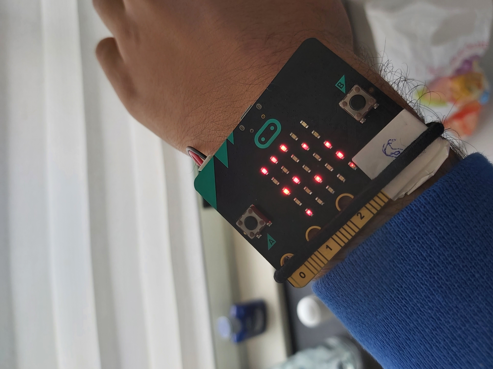

   
   
# The Take a Break Sensor - Micro:bit Radio Sensor



## Table of contents
* [General info](#general-info)
* [Technologies](#technologies-used)
* [Features](#features)
* [Setup](#setup)
* [How does the micro:bit radio work?](#how-does-the-microbit-radio-work?)
* [Project Status](#project-status)
* [Contact](#contact)

## General info
The Take a Break Sensor is the bracelet that brings taking a break to a whole nother level.  
  
We created this project with the intent of solving a problem.  
The problem where workers behind their desks could not be able to work at their full potential because of them sitting behind their desks all day.

The way we solved this problem is by using the radio feature within the micro:bit's to unite the two micro:bit's together to form a connection.
With that connection, we made sure that the timing was made exactly at the right moment with no errors. 
So it is ready to use for u and your colleagues.

We came up with this idea because we had heard some news on a subject on what the effects were if you sat too long in your chair.  
So we started to think of ideas on how to make sure that was not going to happen again and also make sure for a perfect amount of break time which could all lead to a more efficient work time. 


## Technologies Used
Project is created with:
- Python 3.9.0
- Micro:bit version: V1 (V2 is also compatible)

## Features
List the ready features here:
- Exact amount of time before having to walk around.
- Exact amount of work time.
- Exact amount of break time.


## Setup
To run this project, you are going to need two Micro:bit V1 or Micro:bit V2's (combinations are compatible):

```
1 - Connect both of them to your computer.
2 - Download the Project.
3 - Open the microbit map on your file explorer (you can find it at devices and drives).
4 - Put the KAANMIRCOBIT.py onto whichever microbit you'd like to become the sender.
5 - Put the SAMMICROBIT.py onto the other microbit to become the receiver.
6 - You are now ready to use the product.

7 - Turn on the microbit's within the reach of max 70 meters (max 230 feet).
8 - You will know that the product is working if the micro:bit's start to show a connecting animation on their screens.
9 - They will connect within 3 seconds of being turned on.
10 - You will know that they are working if they start to show anything besides the connecting animation.
11 - Enjoy.
```


## How does the microbit radio work?

### The radio module allows devices to work together via simple wireless networks.

### The radio module is conceptually very simple:

    - Broadcast messages are of a certain configurable length (up to 251 bytes).
    - Messages received are read from a queue of configurable size (the larger the queue the more RAM is used). If the queue is full, new messages are ignored. Reading a message removes it from the queue.
    - Messages are broadcast and received on a preselected channel (numbered 0-83).
    - Broadcasts are at a certain level of power - more power means more range.
    - Messages are filtered by address (like a house number) and group (like a named recipient at the specified address).
    - The rate of throughput can be one of three pre-determined settings.
    - Send and receive bytes to work with arbitrary data.
    - As a convenience for children, it’s easy to send and receive messages as strings.
    - The default configuration is both sensible and compatible with other platforms that target the BBC micro:bit.


## Project Status
Project is: _in progress_. 

## Contact
Created by [@unfinished](https://www.unfinishedd.nl)  
Created by [@KaanSecen](https://www.kaansecen.nl)  

- Feel free to contact us!

_This project is open source and available under the Take a Break Sensor License_.